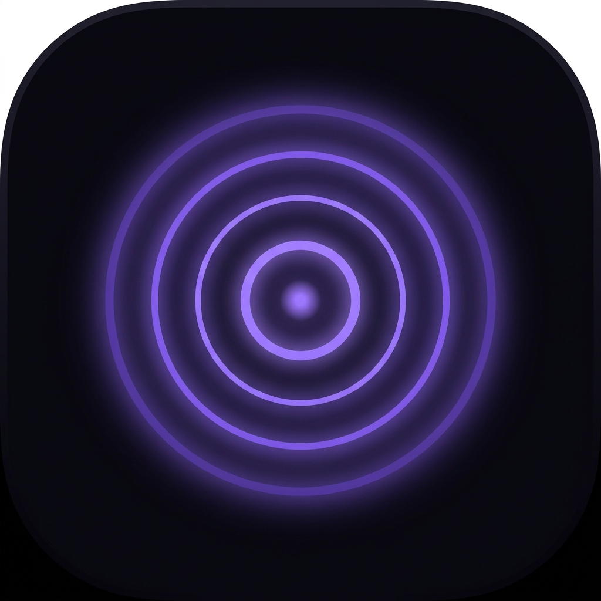

<div align="center">
  
  <h1>Clarity</h1>
  <p><strong>Get back your clarity.</strong></p>
  <p>A focus &amp; app-locking app that puts your distractions behind a lock, so you can give one thing your full attention.</p>
</div>

---

## What it is

Clarity is a mobile app for reclaiming your attention. Name a single focus for the day, lock away the apps that pull at you, run focus sessions to earn time back, and close the day with a reflective check-in.

Every number the app shows you comes out of your own logged history. There are no placeholder stats.

### The design

Arrakis at night. Spice orange and second-sun yellow on a warm near-black, with sand-toned surfaces cut from one stone colour.

- **Barlow** (self-hosted, `public/fonts/`) carries the whole UI
- **Barlow Condensed** carries display: monumental, tracked-out uppercase
- **Cormorant Garamond** italic is reserved for epigraphs — quotes and the block screen, nowhere else

The repeated form is the **spice ring**: the distance you've covered is a solid gradient arc, the distance still ahead is a dotted sand track. An unfinished ring reads as ground left to cross, not a gauge that's low.

### Features

- **Focus sessions** — spice-ring timer, ambient soundscapes, and a session note captured on finish
- **Commit Mode** — opt in and the pause and exit are gone; quitting costs a confirmation and is logged honestly as unfinished
- **The breath gate** — opening a locked app anyway costs a paced 4-in / 6-out breath first. Friction, not a wall
- **App locking + block screen** — a different line each time, and a running count of pulls held
- **Focus windows** — recurring hours where locking turns itself on
- **Insights** — real deep-work totals, week-over-week delta, hold rate, and the full session log
- **Milestones** — earned from the log, never granted for opening the app
- **Command palette** — `⌘K` reaches every screen and action
- **Date navigation** — step back through any logged day
- **Springboard** — a faux home screen showing your locked apps
- **Projects** — pick 3 to protect each week
- **To-do** — checking items moves the Tasks ring
- **AI Review** — snap your work and get a quick read on where it stands
- **Daily Read** — read an article, then record yourself explaining it back
- **Evening check-in** — mood, reflection, and what you made time for, saved onto the day
- **Light and dark** — Arrakis at night, or midday glare

### Keyboard

| Key | Action |
|-----|--------|
| `⌘K` / `Ctrl+K` | Command palette |
| `H` | Home |
| `F` | Start a focus session |
| `L` | Toggle locking |
| `I` | Insights |
| `,` | Settings |
| `Esc` | Back to home |

## Tech

- **Vite** + **React 18** + **TypeScript**
- **Tailwind CSS**, with the palette and type roles as CSS variables in `src/index.css`
- Ambient sound is synthesised with the **Web Audio API** — no audio files ship
- **Capacitor** for native iOS/Android packaging
- Self-contained state store (`src/lib/clarityStore.tsx`) with `localStorage` persistence
- Pure derivations live in `src/lib/clarityStats.ts` and are unit-tested

## Getting started

```bash
npm install
```

```bash
npm run dev
```

| Command | What it does |
|---------|--------------|
| `npm run dev` | Start the dev server on :5173 |
| `npm run build` | Production build |
| `npm run typecheck` | `tsc --noEmit` |
| `npm run lint` | ESLint |
| `npm run test` | Vitest unit tests |
| `npx playwright test` | Screenshot walkthrough + touch-target audit |

## Project layout

```
src/
  components/clarity/     # the app: shell, screens, shared UI
    screens/              # Splash, Intro, Home, Focus, Block, SetTask, Settings,
                          # Projects, Todos, Review, Checkin, Springboard,
                          # Paywall, Articles, Insights, Milestones
    BreathGate.tsx        # the friction device on the block screen
    SpiceRing.tsx         # the app's one repeated form
    CommandPalette.tsx    # ⌘K
    ClarityApp.tsx        # device frame + view router + shortcuts
  lib/
    clarityStore.tsx      # state machine, persistence, derived values
    clarityStats.ts       # pure derivations — streaks, scores, aggregates
    soundscape.ts         # Web Audio soundscapes
    clarityData.ts        # seed data & article content
e2e/                      # Playwright walkthrough + a11y audit
public/fonts/             # Barlow (OFL, see Barlow-OFL.txt)
public/clarity/           # brand assets (icon, aurora, onboarding heroes)
```

## Notes

`supabase/` holds a Deno edge function from an earlier version of this app. Nothing in the current frontend calls it — it is kept only because it may still be deployed. Safe to delete once you've confirmed otherwise.

---

<div align="center"><sub>Built with Claude Code.</sub></div>
